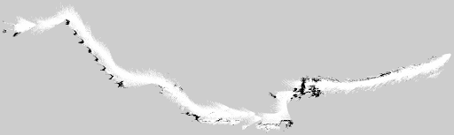
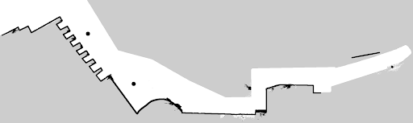
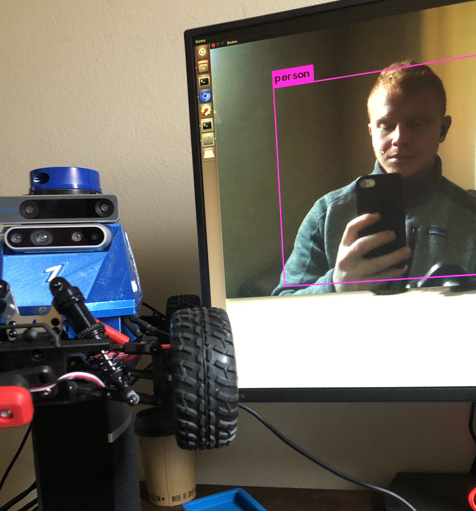

# MuSHR-information

*First and foremost we want to site the MuSHR project for their support and donation of the bot*<br/>

Srinivasa, S.S., Lancaster, P.E., Michalove, J., Schmittle, M., Summers, C., Rockett, M., Smith, J.R., Choudhury, S., Mavrogiannis, C.I., & Sadeghi, F. (2019). MuSHR: A Low-Cost, Open-Source Robotic Racecar for Education and Research. ArXiv, abs/1908.08031.

</br>*We also would like to site yolo*<br/><br/>
Redmon, J., & Farhadi, A. (2018). YOLOv3: An Incremental Improvement. ArXiv, abs/1804.02767.

## Overviews
Our project was intended to create an autonomous vehicle with capabilities to move around on campus. Unfortunately, we ran into some issues due to the coronavirus that made it so we couldn't continue on to final steps with our process. But below we have outlined some of the steps we took on this project. On the robotics side, we needed to figure out how to do a few steps on our bot.

### Mapping
Due to the fact that the lidar that we had didn't work very well outside, we needed to figure out a way to map outdoors using camera input. To get this done, we used RTAB-Map. We had some computational constraints while using this as we had to make very small movements between frames or else it would lose localization. Through this technology, we were able to Map out our route on campus. 



We then cleaned our map manually, since our computational constraints limited our abilities to use loop closures.


This step was completely finished for our project.

### Object Detection
For object detection, we decided to use YoloV3 (You Only Look Once), as cited earlier. We choose yolov3 as it is extremely fast and pretty accurate. Due to our constrained environment, we needed to run something that didn't use too many resources. Yolov3 actually has a 'tiny' version that we were able to leverage that worked very well for us. 


**Future steps**
1. create logic that uses this technology in order to be 'safe' on campus. Since it outputs the class that something is when it detects it, you could set boundaries on if its 80% sure its a person, then stop - or something of that nature.


### Autonomous Navigation
For basic autonomous navigation we leveraged the mushr nav stack that uses a particle filter for localization and a Receding Horizon Controller for path planning in order to operate the bot. We had to change the particle filter to using camera input and then changing the input to a "particle filter" look in order to get accuracy without the lidar. This worked well for our indoor testing environment, which we were able to test it on before the coronavirus hit. 

**Future steps**
1. Deign a nav stack that works well for outdoor navigation within a constrained environment. This was our next step in the process before pivoting to web-design work due to the virus. 

### Files
We have posted our launch file in "files" that is currently runs our object detection, and the basic MuSHR nav stack. 

#### Mapping 
To map an environment with the d435i, follow these steps
1. Open tmux
2. launch roscore
```
roscore
```
2. In a second window, launch the realsense camera
```
roslaunch realsense2_camera rs_camera.launch align_depth:=true unite_imu_method:="linear_interpolation"
```
3. In another window, launch the imu.
```
rosrun imu_filter_madgwick imu_filter_node _use_mag:=false _publish_tf:=false _world_frame:="enu" /imu/data_raw:=/camera/imu /imu/data:=/rtabmap/imu
```
4. Start rtab maps in the last window
```
roslaunch rtabmap_ros rtabmap.launch rtabmap_args:="--delete_db_on_start --Optimizer/GravitySigma 0.3" depth_topic:=/camera/aligned_depth_to_color/image_raw rgb_topic:=/camera/color/image_raw camera_info_topic:=/camera/color/camera_info approx_sync:=false wait_imu_to_init:=true imu_topic:=/rtabmap/imu
```
5. Make sure to move slow and watch output to make sure that it able to track its movements and it hasn't lost localization.
6. kill the processes.
7. The map is located at ~/.ros/rtabmap.db

Above steps were found at http://wiki.ros.org/rtabmap_ros/Tutorials/HandHeldMapping
